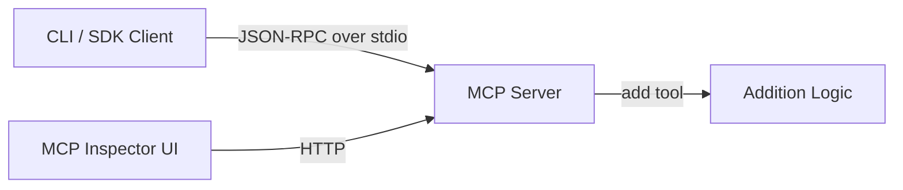

# MCP Server Example

This repository demonstrates a simple Model Context Protocol (MCP) server built with the `@modelcontextprotocol/sdk` and `zod`. The server exposes a tool for adding two numbers over a standard I/O transport and can be inspected via the official MCP Inspector.

## Features

- Defines an MCP tool to perform numeric addition
- Uses `zod` for input validation and schema definition
- Runs over a stdio transport (JSON-RPC)
- Inspectable with the MCP Inspector UI

## Prerequisites

- Node.js (>=14)
- npm
- Git

## Quick Setup

```bash
# Clone or initialize project
git clone https://github.com/genechan/localMCP
cd localMCP

# Install dependencies
yarn install

# Initialize TypeScript
tsc --init
```

## Build & Run

```bash
# Compile TypeScript
tsc

# Start server
node build/index.js
```

## Testing with MCP Inspector

```bash
npx @modelcontextprotocol/inspector node build/index.js
```

Navigate to [http://localhost:6274](http://localhost:6274) to exercise the `add` tool.

## Architecture Diagram



## Next Steps

- Add more tools or resources to your server
- Secure transport (WebSocket or HTTP) for production
- Integrate with external APIs (e.g., GitHub, Notion)
- Write unit and integration tests
